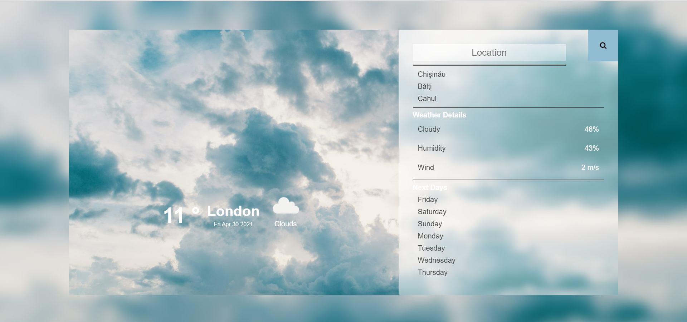

# Weather App

This app display weather data and 7 day forecast from any city in the world using the [OpenWeatherMap](http://www.openweathermap.org/) API.

## Screenshot

## Demo

You can view the working demo here: [https://kazsergiu.github.io/vanilla-js-weather-app/](https://kazsergiu.github.io/vanilla-js-weather-app/)

## Features

- It shows weather by entering the city name
- Show 7 day weather forecast of the city

## Tools/Languages

The following are the languages or tools I used to build the app:

- HTML and CSS
- JavaScript(ES6+)
- [Open Weather API](http://api.openweathermap.org)
- [Pexels](https://www.pexels.com/)
